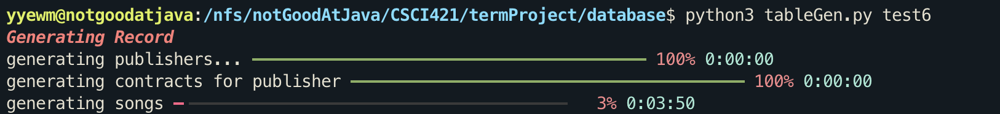

### ER-Diagram


### Database Schema && Normal Form Argument

- publisher:

```sql
create table publisher (
    publisher_id int not null,
    publisher_name varchar(20),
    primary key (publisher_id)
);
```

Two fields, BCNF

- Contract (Grant):

```sql
create table contract_t (
    contract_id int not null,
    publisher_id int not null,
    contract_title varchar(50),
    start_date timestamp,
    end_date timestamp,
    primary key(contract_id),
    foreign key (publisher_id) references publisher (publisher_id)
);
```

functional dependencies: contract_id is the candidate key and there are no other candidate keys. BCNF

- Song

```sql
create table song (
    song_id int not null,
    contract_id int not null,
    title varchar(40) not null,
    language lang not null,
    description text,
    artist varchar(20),
    primary key (song_id),
    foreign key (contract_id) references contract_t (contract_id),
);
```

functional dependencies: song_id and  is candidate key, no other non-trivial functional dependencies. BCNF

- Song_stats:

```sql
create table song_stats (
    song_id int not null,
    week_start timestamp,
    week_end timestamp,
    hit_rate numeric(2) check(hit_rate <= 1 and hit_rate >= 0),
    avg_rating numeric(2),
    primary key (song_id, week_start, week_end),
    foreign key (song_id) references song (song_id)
);
```

functional dependencies: (song_id, week_start, week_end) is candidate key. No other non-trivial functional dependencies. BCNF

- Version:

```sql
create table version (
    song_id int not null,
    version_id int not null,
    version_name varchar(20),
    resource_url varchar(20),
    primary key (song_id, version_id),
    foreign key (song_id) references song (song_id)
);
```

functional dependencies: (song_id, version_id) is candidate key. No other non-trivial functional dependencies. BCNF

- User:

```sql
create table user_t (
    user_email email_type not null,
    alias varchar(20) not null,
    password varchar(50) not null,
    primary key (user_email)
);
```

functinal dependencies: user_email is candidate key. No other non-trivial functional dependencies. BCNF

- User_stat

```sql
create table user_stats (
    user_email email_type not null,
    week_start timestamp not null,
    week_end timestamp not null,
    active_hours numeric(2),
    favorite_song int,
    primary key (user_email, week_start, week_end),
    foreign key (favorite_song) references song (song_id),
    foreign key (user_email) references user_t (user_email)
);
```

functional dependencies: (user_email, week_start, week_end) is candidate key. No other non-trivial functional dependencies. BCNF

- Privilege:

```sql
create table privilege (
    title varchar(10) not null,
    description text,
    primary key (title)
);
```

BCNF

- Have_privilege

```sql
create table have_privilege (
    user_email email_type not null,
    privilege_title varchar(10) not null,
    primary key (user_email, privilege_title),
    foreign key (user_email) references user_t (user_email),
    foreign key (privilege_title) references privilege (title)
);
```

BCNF

- Requires_privilege

```sql
create table requires_privilege (
    song_id int not null,
    version_id int not null,
    privilege_title varchar(10) not null,
    primary key (song_id, version_id, privilege_title),
    foreign key (song_id, version_id) references version (song_id, version_id),
    foreign key (privilege_title) references privilege (title)
);
```

Functional dependencies: (song_id, version_id, privilege_title) is candidate key. No other non-trivial functional dependencies. BCNF

- playlist

```sql
create table play_list (
    play_list_id SERIAL,
    created_by email_type not null,
    title varchar(40),
    description text,
    creation_time timestamp,
    label label_type,
    primary key (play_list_id),
    foreign key (created_by) references user_t (user_email),
    unique(created_by, title)
);
```

functional dependencies: play_list_id and (created_by, title) are both candidate keys. 3NF

- Include_song

```sql
create table include_song (
    play_list_id int not null,
    song_id int not null,
    primary key (play_list_id, song_id),
    foreign key (play_list_id) references play_list (play_list_id),
    foreign key (song_id) references song (song_id)
);
```

BCNF

### Requirements

**Publisher/Artist:**(Author: Yangchen Ye)

- I want to make sure that my contract information is NOT accessible to other publishers (authentication).
- I need to have the ability to add new song resources or remove existing ones.I want to be able to offer different versions of the same song resources (different quality, for example) and I hope the system is able to stream different resources based on user selection.
-  Also, some high-quality versions might need different subscription levels than lower-quality ones.

**Platform (music player):**(Author: Jiaying Chen)

- I want to know the hit rate of each song.
- I want to know the duration that each user spends on my platform (content hour) during a particular time period (e.g. in a week).
- I want to know the number of active users on my platform during a particular period (e.g. in a week).
- I want to keep the license information for each song with the publishers. 
- I want to maintain the subscription relationship with users.

**User:**(Author: Merielyn Sher)

- I should be able to create an account with a unique ID on the platform and also have my own profile/personal info.
- I want to be able to search for songs and artists. 
- I want to be able to create/delete playlists. I also want to add songs to or remove songs from my playlists. 
- I want to be able to subscribe/unsubscribe (i.e. join or cancel membership) to gain access to different songs.

### Generation Program Instruction

requirement: Our generation program uses python package `typer ` to manage command line argument and `rich` to format a progress bar. If you run the program on our vm, they are already installed, otherwise you might need to install the package first. After this is ready:

1. create a database `createdb $dbname`
2. define table using our ddl file `psql $dbname < ddl.sql`
3. run the program `python3 table_generate.py $dbname`



You should be able to see the progress of generation like this. When the program ends, you can log in to your database and see the generated records.


Note that our program uses psycopg2 to **directly insert records into the database** without storing queries in a file. We made this decision for the following reasons.

1. A sql file for millions of queries is too large, especially on a virtual machine. 
2. We cannot utilize rich's progress bar functionality if we directly import the query through psql, which means the stdout output is really unhelpful (a bunch of `INSERT 1 0`) and we cannot see progress clealy and measure the total time used in the process.
3. Without the overhead of writing and reading files, we can insert more records in time.

Also note that you can change the currently hard-coded parameters to change the program's running time. We now configured the parameters so that it runs for about an hour on our vm, but the running time could certainly change on different machines with different hardware.

### Interface Instruction & Documentation

#### How to run:

Our interface uses package `psycopg2` and `pandas`，they are installed on our vm, but you might need to install them if you are not running our program on our vm.

Our interface connects to database 'music_player'. Before testing our interface, make sure the database 'music_player' is set up. This can be done by running `createdb music_player`, `psql music_player < ddl.sql` and `psql music_player < insert_records_small.sql`. To run the interface, first unzip our source code and run`cd notGoodAtJava` to enter the source directory, then run`python3 cmdInterface.py`

#### Documentation:

Our interface supports following functionalities:

##### User:

1. Login:

Interface will prompt you for your email and password, check against the database to see if there's a matching record. If so, log you in otherwise reject the login. Note that our user functionalities requires a valid user email either via login or register. Please enter your user email and password separated by comma without any space.

2. Register:

Interface will prompt you for your email, alias and password, check to see if the email is already used to login. If the email already exists, registration fails and we prompt you to log in. Also, we perform a valid email check on the database side to only approve email of type "\*@\*.\*", (for example, "*@email.wm.edu" will not be a valid email in our system). If the email is invalid, we reject the request and give some hint on the error. Otherwise we register you as a user and proceed to other functionalities.

3. Browse songs:

List available songs from which you can choose

4. See versions available for a song:

We prompt you for a song id (presumably known from browsing) and show a list of available versions of this song that you can play.

5. Play a version of a song:

Prompt for song id and version id. Check if the logged in user has enough privilege to play this version. If so, play it. Otherwise, reject the request.

6. Search for song by artist:

Prompt user for an artist name. Search and show all the songs written by this artist. This feature only supports exact matches of artist names, although letter case does not matter. 

7. Browse Playlist

Show a list of playlist available on our system along with songs included.

8. Create Playlist:

Prompt user for the name, description and label of the playlist. Check if this logged user has already created a playlist of the same name. If so reject the request. Also, we only support labels in ['Pop', 'Classic', 'Nostalgic', 'None']，if user input incorrect label, we reject the request and give hint. If everything is ok, we register the playlist in our database.

9. Delete Playlist:

Prompt user for the ID of the playlist to delete. A user is only allowed to delete a playlist they created.

10. Add/Remove Song from playlist:

Prompt user for a playlist id and a song id to add or emove. First check if the playlist belongs to the user: We only allow user to modify playlists created by them and the request would be rejected otherwise. Then we insert/remove the specified song to the playlist and show failure if the song already exists in the playlist.

11. Unlog:

Unlog from the current user account.

12. Browse my subscription:

View my current subscription level.

13. Subscribe/Unsubscribe:

Show user possible options for subscription and prompt user for a subscription title to subscribe/unsubscribe. For user's attempt to subscribe, the input is checked for whether the specified title exist and whether the user already has it. For attempts to unsubscribe, we check for existance of the provided title and do not allow for unsubscribing as a "user", the basic title.  We then insert/remove the provided title of subscription to/from the have_privilege table. 

##### Administrator:

1. User stat dashboard:

Show a summary of user activity based on weeks. For every week, show average user active hour and number of active users. For thid method, we assume the week_end attribute to be in the format of 'yyyy-mm-dd 11:59:59'. This assumption is fair since the user of our interface is not allowed to modify the user stats table.

2. Search song stat by week:

Prompt administrater to give a date in format "mm/dd/yyyy" and show all the song stats in a week ending with that date, including hit_rate and avg_rating and song informations.

3. Search users with subscription detail:

Prompt for a user email and show all the subscription he has

4. Search publishers with contract information:

Prompt for a publisher id and show all the contract associated with this publisher

##### Publisher:

1. Login/register:

We only provides functionality for logged in publishers, so we will prompt user to give their unique identifying publisher id for login. For register, we prompt for an id and a name.

2. Browse my contract:

Show a list of contracts made by the logged publisher

3. See contract detail:

Prompt for a contract_id, first check to see this contract exists and is made by the logged in publisher. Otherwise we reject the request for privacy cocnerns. If the contract is valid, then we show all the songs granted in this contract

4. Add song for contract:

Prompt for contract id, song id, title, language, description and artist from publisher. We first check if the contract is valid and is made by the logged in publisher, otherwise we reject the request. Then we try to insert song to that contract with constraints: song id has to be unique, language has to be in our supported language set. If insertion fails we give hint on the error, otherwise we persist the song to our database.

5. Add version to song:

Since user can only play a specific version (with resource), we allow publishers to add versions to his song. We prompt for necessary information and also check that the song modified belongs to his contract. Publisher cannot modify each other's contract or song.

6. Make Privilege Requirement for specific version:

We prompt for necessary information from publisher. First we check the song he wants to make requirement on belongs to him, reject the request if not. Then we try to insert the privilege requirement in our database. Possible failures are: versions does not reference an existing version, the requirement already exists. We give hint on the error upon failure, otherwise we persist the record.

7. Unlog:

Unlog from the current publisher account.

